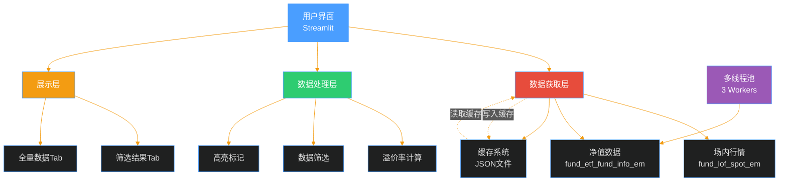
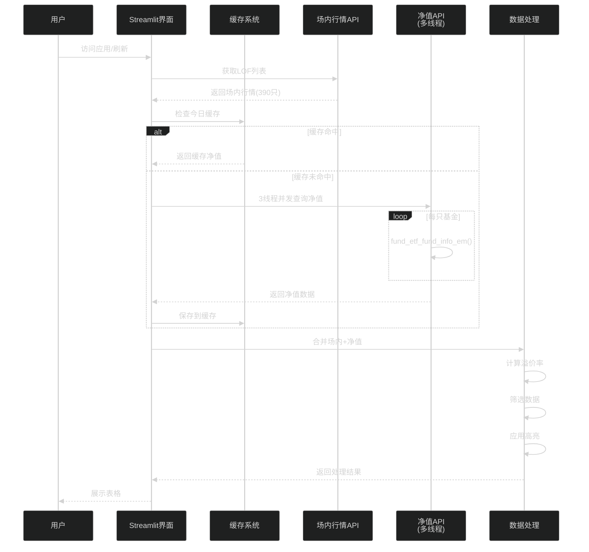
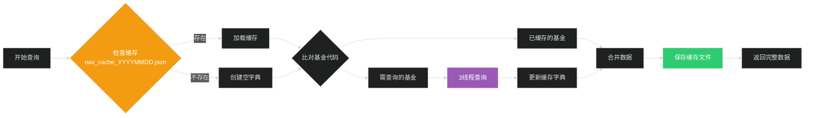
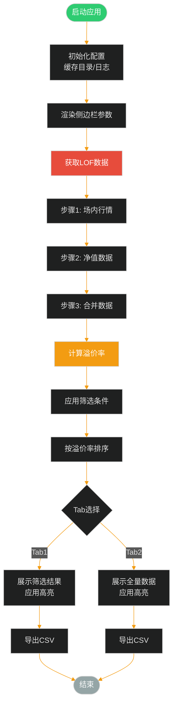
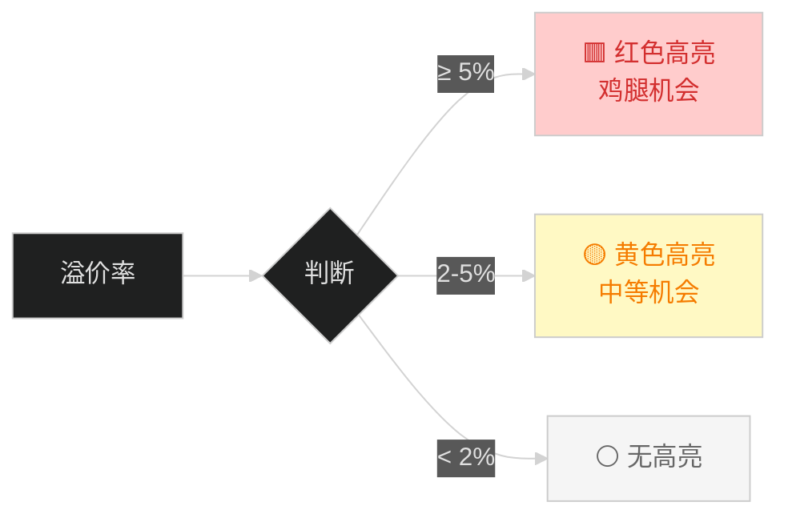

# LOF 基金套利监控系统 - 技术文档

## 一、系统概述

### 1.1 项目简介
本系统是一个基于 Streamlit 的 Web 应用程序，用于实时监控中国市场 LOF 基金的套利机会，通过计算场内价格与基金净值的溢价率，帮助投资者发现"场外申购、场内卖出"的套利机会。

### 1.2 核心功能
- 实时获取 LOF 基金场内行情数据
- 批量查询基金真实净值
- 自动计算溢价率
- 溢价率分级高亮显示（≥5%红色，2-5%黄色）
- 支持参数化筛选
- 数据缓存机制（按日期）
- 多线程加速查询（3线程）

### 1.3 技术栈
- **前端框架**: Streamlit 1.28+
- **数据处理**: Pandas, NumPy
- **数据源**: Akshare（东方财富）
- **并发处理**: ThreadPoolExecutor
- **数据持久化**: JSON 文件缓存

---

## 二、系统架构

### 2.1 整体架构图



### 2.2 模块划分

| 模块 | 文件/函数 | 功能描述 |
|------|----------|---------|
| **缓存模块** | `load_nav_cache()`, `save_nav_cache()` | 读写日期缓存文件 |
| **数据获取** | `get_lof_data()`, `fetch_single_nav()` | 获取场内行情和净值 |
| **数据处理** | `calculate_premium_rate()`, `filter_opportunities()` | 计算溢价率和筛选 |
| **展示渲染** | `highlight_premium_level()`, `format_turnover()` | 高亮和格式化 |
| **主控制器** | `main()` | 主流程控制 |

---

## 三、数据流程

### 3.1 数据流转图



### 3.2 缓存机制



---

## 四、核心逻辑

### 4.1 主流程逻辑



### 4.2 溢价率计算公式

```python
溢价率(%) = (场内价格 - 基金净值) / 基金净值 × 100
```

**示例：**
- 场内价格：3.094 元
- 基金净值：2.5706 元
- 溢价率：(3.094 - 2.5706) / 2.5706 × 100 = **20.36%**

### 4.3 高亮规则



---

## 五、关键函数说明

### 5.1 数据获取函数

#### `get_lof_data()`
**功能**: 主数据获取函数，协调场内行情和净值数据的获取

**流程**:
1. 调用 `ak.fund_lof_spot_em()` 获取场内行情
2. 检查当日缓存 `nav_cache_YYYYMMDD.json`
3. 使用 3 线程并发查询未缓存的基金净值
4. 合并场内行情和净值数据
5. 返回完整 DataFrame

**返回字段**:
- 基金代码
- 基金名称
- 场内价格
- 基金净值
- 实时估值
- 场内成交额

#### `fetch_single_nav(fund_code, start_date, end_date)`
**功能**: 单只基金净值查询（多线程调用）

**参数**:
- `fund_code`: 基金代码（如 "161226"）
- `start_date`: 查询起始日期（格式 YYYYMMDD）
- `end_date`: 查询结束日期（格式 YYYYMMDD）

**返回**:
```python
{
    '基金代码': '161226',
    '基金净值': 2.5706,
    '净值日期': '2026-01-15',
    'success': True
}
```

### 5.2 缓存函数

#### `load_nav_cache(cache_date)`
**功能**: 加载指定日期的净值缓存

**缓存文件路径**: `lof_cache/nav_cache_20260116.json`

**缓存结构**:
```json
{
  "161226": {
    "基金代码": "161226",
    "基金净值": 2.5706,
    "净值日期": "2026-01-15"
  },
  "160212": {
    "基金代码": "160212",
    "基金净值": 4.6528,
    "净值日期": "2026-01-15"
  }
}
```

#### `save_nav_cache(cache_date, nav_dict)`
**功能**: 保存净值缓存到 JSON 文件

**注意事项**:
- 确保数据类型可序列化（日期转字符串）
- 使用 UTF-8 编码
- 缩进 2 空格便于阅读

### 5.3 数据处理函数

#### `calculate_premium_rate(df)`
**功能**: 计算溢价率并添加到 DataFrame

```python
df['溢价率(%)'] = ((df['场内价格'] - df['基金净值']) / df['基金净值'] * 100).round(2)
```

#### `filter_opportunities(df, min_premium, min_turnover)`
**功能**: 根据用户参数筛选套利机会

**筛选条件**:
- 溢价率 > `min_premium`（默认 1.5%）
- 场内成交额 > `min_turnover`（默认 50 万）

#### `highlight_premium_level(row)`
**功能**: 根据溢价率应用高亮样式

**高亮规则**:
```python
if premium >= 5.0:
    return 红色高亮
elif premium >= 2.0:
    return 黄色高亮
else:
    return 无高亮
```

---

## 六、性能优化

### 6.1 多线程加速

**问题**: 逐个查询 390 只基金净值耗时过长

**解决方案**: 使用 `ThreadPoolExecutor` 3 线程并发

```python
with ThreadPoolExecutor(max_workers=3) as executor:
    future_to_code = {
        executor.submit(fetch_single_nav, code, start_date, end_date): code
        for code in need_fetch_codes
    }
    for future in as_completed(future_to_code):
        result = future.result()
```

**性能提升**: 理论加速 3 倍

### 6.2 日期缓存

**问题**: 每次刷新都重复查询相同数据

**解决方案**: 按日期缓存，同一天只查询一次

**缓存命中率**: 第二次及以后访问 100% 命中

**缓存清理**: 用户手动删除 `lof_cache` 文件夹

---

## 七、数据字典

### 7.1 主数据表结构

| 字段名 | 类型 | 说明 | 数据源 |
|--------|------|------|--------|
| 基金代码 | str | 6位代码，如 161226 | 场内行情API |
| 基金名称 | str | 如"国投白银LOF" | 场内行情API |
| 场内价格 | float | 实时交易价格（元） | 场内行情API |
| 基金净值 | float | 最新公布净值（元） | 净值API + 缓存 |
| 实时估值 | float | 盘中估算（= 净值） | 计算字段 |
| 场内成交额 | float | 当日成交额（元） | 场内行情API |
| 溢价率(%) | float | 计算得出 | 计算字段 |

### 7.2 筛选参数

| 参数名 | 类型 | 默认值 | 范围 | 说明 |
|--------|------|--------|------|------|
| 最小溢价率 | float | 1.5% | 0-10% | 过滤低溢价品种 |
| 最小成交额 | int | 50万 | 0-500万 | 保证流动性 |

---

## 八、用户界面

### 8.1 侧边栏参数

- **筛选参数设置**
  - 最小溢价率滑块（0-10%，步长0.1%）
  - 最小成交额滑块（0-500万，步长10万）
- **使用说明**
  - 提示：申购状态和限额为模拟数据

### 8.2 主界面布局

```
┌─────────────────────────────────────────┐
│ 💰 LOF 基金套利监控系统                  │
│ 场外申购、场内卖出套利机会实时监控        │
├─────────────────────────────────────────┤
│ 🔄 刷新数据                              │
├─────────────────────────────────────────┤
│ 📈 数据概览                              │
│ [总LOF] [符合条件] [🍗鸡腿] [最高溢价]   │
├─────────────────────────────────────────┤
│ [📋 套利机会列表] [📊 全量LOF数据]        │
│ ┌─────────────────────────────────────┐ │
│ │ 🟥 红色 = 高溢价(≥5%)                │ │
│ │ 🟡 黄色 = 中等溢价(2-5%)             │ │
│ │                                     │ │
│ │ [数据表格 - 600px高度]               │ │
│ │                                     │ │
│ └─────────────────────────────────────┘ │
│ 📥 导出为 CSV                            │
└─────────────────────────────────────────┘
```

---

## 九、错误处理

### 9.1 异常捕获

| 异常类型 | 处理方式 | 用户提示 |
|---------|---------|---------|
| Akshare未安装 | 返回None | ❌ Akshare未安装 |
| API调用失败 | 记录日志，继续处理 | 部分数据获取失败 |
| 缓存读写失败 | 降级到全量查询 | ⚠️ 缓存读取失败 |
| 数据为空 | 返回None | ❌ 无法获取数据 |

### 9.2 日志级别

```python
logger.info()    # 正常流程
logger.warning() # 警告（如缓存失败、部分基金查询失败）
logger.error()   # 错误（如API失败、数据为空）
```

---

## 十、部署说明

### 10.1 环境要求

```bash
# 使用 Conda 创建环境
conda create -n lof_jt python=3.10 -y
conda activate lof_jt

# 安装依赖
pip install -r requirements.txt
```

### 10.2 运行方式

```bash
# 开发模式
streamlit run app.py

# 指定端口
streamlit run app.py --server.port 8888
```

### 10.3 目录结构

```
lof_jt/
├── app.py                  # 主程序
├── requirements.txt        # 依赖清单
├── README.md              # 使用文档
├── 技术文档.md             # 本文档
└── lof_cache/             # 缓存目录
    └── nav_cache_20260116.json  # 日期缓存
```

---

## 十一、未来优化方向

### 11.1 功能增强
- [ ] 增加历史溢价率走势图
- [ ] 支持邮件/微信实时提醒
- [ ] 增加收益计算器
- [ ] 支持自定义高亮阈值

### 11.2 性能优化
- [ ] 增加线程池大小配置
- [ ] 支持增量更新缓存
- [ ] 添加数据库持久化
- [ ] 优化大数据量渲染

### 11.3 数据源
- [ ] 集成集思录 API
- [ ] 支持多数据源切换
- [ ] 获取真实申购状态和限额

---

## 十二、常见问题

### Q1: 为什么没有申购状态和单日限额？
**A**: 因为 Akshare 的 LOF 接口不提供这些数据，之前使用的随机模拟数据会误导用户，所以移除了。

### Q2: 缓存文件在哪里？
**A**: `lof_cache/nav_cache_YYYYMMDD.json`，按日期命名。

### Q3: 如何清空缓存？
**A**: 直接删除 `lof_cache` 文件夹即可。

### Q4: 为什么第一次运行很慢？
**A**: 需要查询 390 只基金的净值，即使用 3 线程也需要一定时间。第二次访问会直接读缓存，速度很快。

### Q5: 溢价率为负数是什么意思？
**A**: 表示场内价格低于净值，属于折价，不适合"场外申购、场内卖出"套利。

---

## 附录

### A. 关键依赖版本

```
streamlit >= 1.28.0
pandas >= 1.5.0
numpy >= 1.23.0
akshare >= 1.11.0
```

### B. 参考链接

- [Streamlit 文档](https://docs.streamlit.io/)
- [Akshare 文档](https://akshare.akfamily.xyz/)
- [Pandas 文档](https://pandas.pydata.org/)

---

**文档版本**: v1.0  
**最后更新**: 2026-01-16  
**维护者**: 大彩电

---

## 附录 C：AI 项目重现提示词

如果你希望在新的 AI 对话中重新生成本项目，可以使用以下提示词：

---

### 🤖 完整提示词

```
**角色：** 你是一位精通 Python 金融数据抓取和 Web 开发的专家级程序员。

**目标：** 我要开发一个 Python Web 应用程序（使用 Streamlit 框架），用于实时监控中国市场的 LOF 基金（上市型开放式基金），寻找"场外申购、场内卖出"的套利机会。

**用户背景：**
我是"免五"用户（免除证券交易最低5元佣金限制）。我关注高溢价的套利机会，因为我的交易成本极低。

**核心功能需求：**

1. **数据获取**
   - 使用 Akshare 库的 `fund_lof_spot_em()` 获取 LOF 场内实时行情（390只左右）
   - 使用 `fund_etf_fund_info_em(fund_code)` 批量获取每只基金的真实净值
   - 实现**3线程并发查询**净值数据，提升性能
   - 实现**按日期缓存**机制：缓存文件命名格式 `lof_cache/nav_cache_YYYYMMDD.json`，同一天只查询一次

2. **数据处理**
   - 计算溢价率：`(场内价格 - 基金净值) / 基金净值 × 100%`
   - 筛选条件（用户可调）：
     * 最小溢价率（默认 1.5%）
     * 最小成交额（默认 50万）
   - 按溢价率降序排序

3. **UI/UX 需求**
   - 使用 Streamlit 构建界面
   - 侧边栏：参数设置（溢价率和成交额滑块）
   - 主界面：
     * 数据概览卡片：总LOF数量、符合条件、🍗鸡腿机会（溢价≥5%）、最高溢价率
     * **两个Tab**：
       - Tab1: 筛选后的套利机会列表
       - Tab2: 全量LOF数据（所有390只）
   - **溢价率分级高亮**：
     * 🟥 红色：溢价 ≥ 5%（鸡腿机会）
     * 🟡 黄色：溢价 2-5%（中等机会）
     * ⚪ 无色：溢价 < 2%
   - 每个Tab都有独立的CSV导出按钮

4. **技术栈**
   - Python 3.10+
   - Streamlit >= 1.28.0
   - Pandas, NumPy
   - Akshare >= 1.11.0
   - concurrent.futures (ThreadPoolExecutor)
   - json, logging

5. **关键实现细节**
   - 缓存保存时确保数据类型可序列化（日期转字符串）
   - 使用 `ThreadPoolExecutor(max_workers=3)` 并发查询净值
   - 高亮函数命名：`highlight_premium_level(row)`
   - 数据字段：基金代码、基金名称、场内价格、基金净值、实时估值、场内成交额、溢价率(%)
   - **不要**生成模拟的"申购状态"和"单日限额"字段（因为无法获取真实数据）
   - 缓存目录：`lof_cache/`，自动创建，用户可手动删除清空缓存

6. **日志要求**
   - 配置 logging，输出到控制台
   - 关键步骤：场内行情获取、缓存检查、多线程查询、数据合并等都要有日志
   - 日志级别：INFO（正常流程）、WARNING（部分失败）、ERROR（严重错误）

7. **错误处理**
   - Akshare 未安装时直接报错，不使用Mock数据
   - API调用失败时记录日志，继续处理其他基金
   - 数据获取失败时返回 None，在 UI 显示明确错误信息

8. **性能优化**
   - 首次查询390只基金约需2-3分钟（3线程）
   - 第二次访问直接读缓存，几秒内完成
   - 进度条显示：`正在获取基金净值... (150/390)`

**输出要求：**
请提供完整的、可运行的 Python 代码（`app.py`），包含详细注释。另外提供 `requirements.txt` 依赖清单。

**特别强调：**
- 不要使用Mock数据，真实数据获取失败就明确告诉用户
- 缓存机制必须按日期（YYYYMMDD）命名
- 必须使用3线程并发查询
- 溢价率高亮分级必须清晰（红/黄/无色）
- Tab必须包含全量数据展示，不只是筛选结果
```

---

### 📝 使用说明

1. 将上述提示词完整复制
2. 在新的 AI 对话中粘贴并发送
3. AI 将生成与本项目功能一致的完整代码

### ⚠️ 注意事项

- 提示词中已包含所有核心需求，但你可以根据实际情况微调参数
- 如果AI生成的代码有细节差异，可以追加具体要求进行调整
- 建议先在测试环境验证生成的代码，确认功能完整性

---

**文档版本**: v1.0  
**最后更新**: 2026-01-16  
**维护者**: 大彩电
